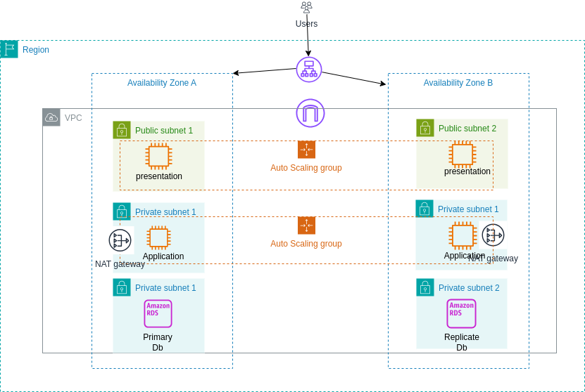

# AWSChallenge001
designing a three-tier architecture

## Introduction
The challenge is to design a three-tier architecture for a company currently operating with a one-tier architecture. The goal is to upgrade the infrastructure to be highly available, reliable, cost-effective, and secure.

## Architecture Objectives

1. **High Availability:** The architecture must ensure that the services are accessible with minimal downtime.
2 **Reliability:** The system should consistently perform its intended functions without failure.
3. **Cost-Effectiveness:** Optimize resource usage to minimize costs while meeting performance requirements.
4. **Security:** Implement robust security measures to protect sensitive data and ensure a secure environment.

## Three-Tier Architecture Design

I Designed the proposed three-tier architecture consists of three main layers:

Below is the diagram of the proposed architecture

The architecture diagram illustrates the process flow of the three-tier architecture. From User request, a load balancer distributes the traffic across multiple servers (In different availability zones) to ensure load distribution and fault tolerance. The web servers serve static content and handle initial user requests. The application servers execute application logic and process dynamic content.(In private subnets) but can communicate with the data layer to retrieve or store information. The database stores and manages structured data. It ensures data integrity and security.

## Components and Their Roles
1. **VPC:**
   - A virtual private cloud (VPC) is a virtual network dedicated to your AWS account. It is logically isolated from other virtual networks in the AWS Cloud. 
2 **Availability Zones:**
   - Availability Zones are isolated locations within data center regions from which public cloud services originate and operate.
   will be used to ensure high availability and fault tolerance.
3. **Subnets:**
    - A subnet is a logical subdivision of an IP network. The practice of dividing a network into two or more networks is called subnetting.
    will be used to ensure high availability and fault tolerance.
4. **Internet Gateway:**
    - An internet gateway is a component that allows communication between vpc and the internet.
5. **Route Tables:**
    - A route table contains a set of rules, called routes, that are used to determine where network traffic is directed.

6. **Load Balancers:**
   - Distribute incoming network traffic across multiple servers to ensure no single server is overwhelmed.
   - Facilitate scalability and fault tolerance.

7. **Web Servers:**
    - Serve static content and handle initial user requests.
    - Communicate with the application servers to process dynamic content.

8. **Application Servers:**
    - Execute application logic and process dynamic content.
    - Interact with the data layer to retrieve or store information.

9. **Databases:**
    - Store and manage structured data.
    - Ensure data integrity and security.

## Note
I will be improving this design and implementing it on AWS on my next challenge.
